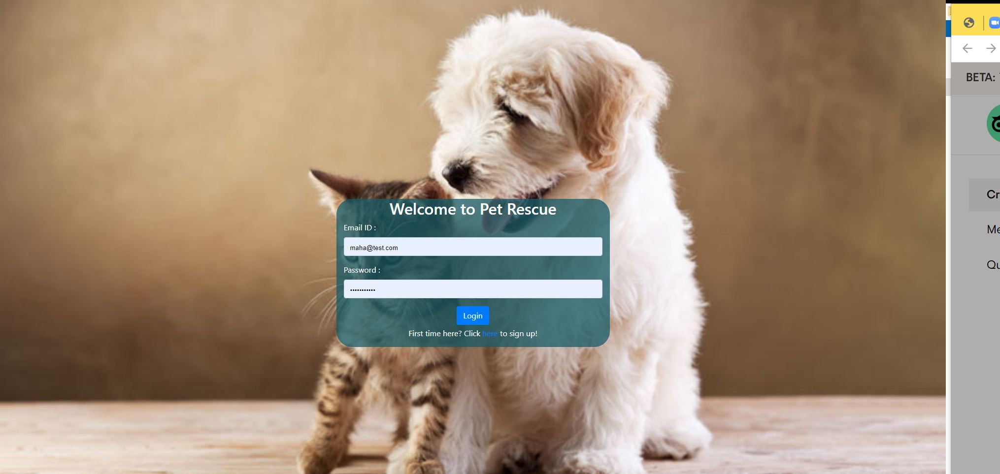
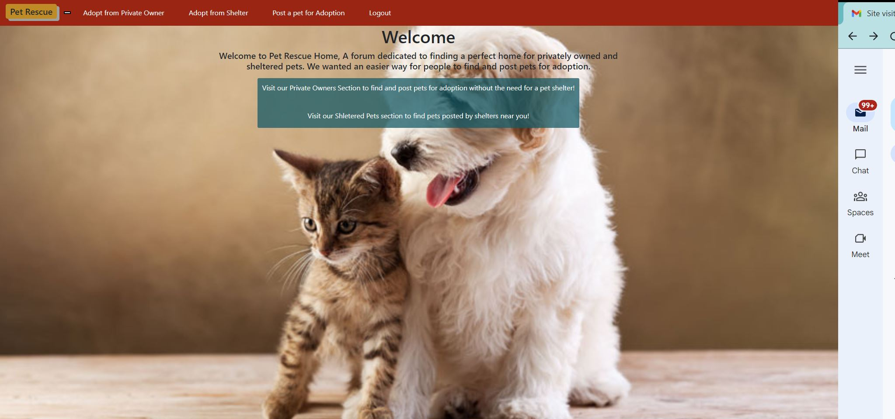
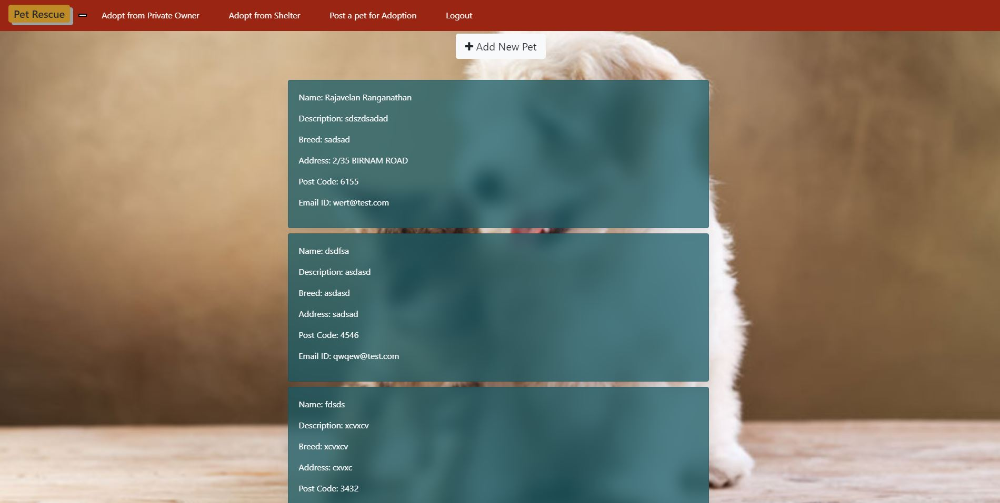
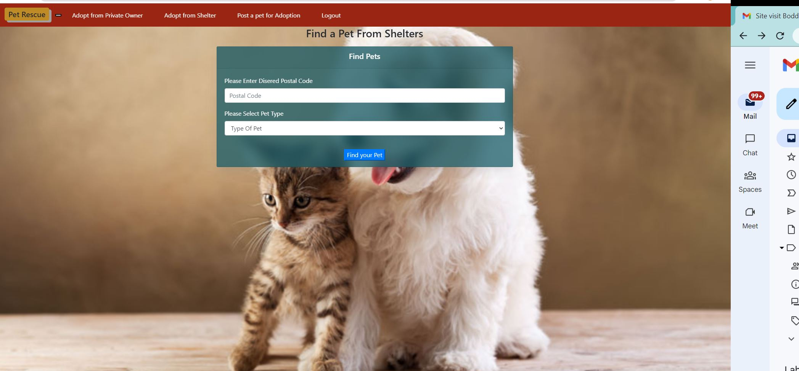

# PetRescue

## Table of Contents
* [Description](#description)
* [Application Live URL](#application-live-url)
* [Application Screenshot](#application-screenshot)
* [Installation](#installation)
* [Usage](#usage)
* [License](#license)
* [Contributing](#contributing)
* [Test Instruction](#tests)
* [Github Link](#github)
* [Reach me for any additional queries](#email)

## Description
PetRescue application is a node based application that utilizes the MySQL database ,handlebars to display the HTML front end pages and it uses GET and POST methid to get the data from DB and insert the data into the backend for the client requst.

## Application Live URL:
[PetRescue Live URL]()

## Application Demo
The following screenshot shows the Home page of the PetRescue

 

 

 

## Installation
Run the following at the command line
    - npm install 
    - npm run seed

Run 'npm start' to start the server

## Usage
This is an web application to adopt a pet from private owners and from shelter near by you. It uses Express.js for routing, a MySQL database,handlebars for front end view. The seed data is created using 'npm run seed' command.

## License

## Contributing
 Mahalakshmi Rajendran

## Test Instructions
N/A

## Github
Visit my github profile here: [Maharjn](https://github.com/Maharjn)

## Email
Email me with any questions : maharajendran.89@gmail.com
